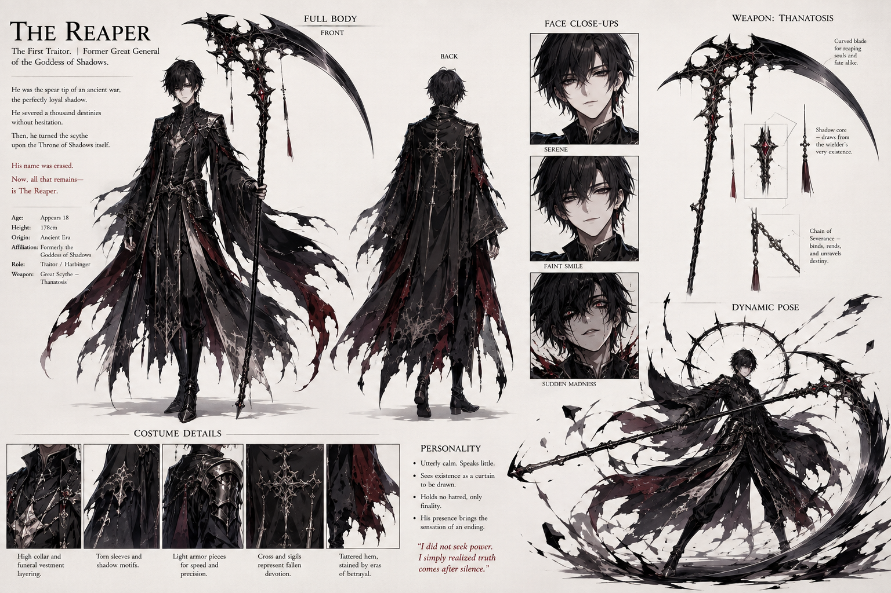

# Vael — referência visual v1

> **Status:** referência visual canônica.

Folha do Ceifador, antigo Grande General das Sombras e vilão final. Inclui vistas frontal e traseira, três estados faciais, estudo da foice e pose de combate.

## Elementos que devem permanecer

- Aparência de jovem de cerca de 18 anos, esguio e de beleza inquietante.
- Cabelo preto desalinhado, pele pálida e olhos escuros com acentos vermelhos.
- Expressão habitual serena e quase vazia.
- Ruptura rara para um semblante tomado por loucura; não banalizar essa mudança.
- Vestes funerárias negras em camadas, rasgadas, com armadura leve e detalhes vermelho-escuros.
- Foice enorme, negra e cerimonial, visualmente mais antiga que a cultura atual.
- Fragmentos de sombra e halo circular partido nas cenas de poder.

Nomes, frases e biografia impressos dentro da folha não são canônicos. Consulte a [ficha de Vael](../../../../../../docs/personagens/grandes-generais/trevas/vael.md).
