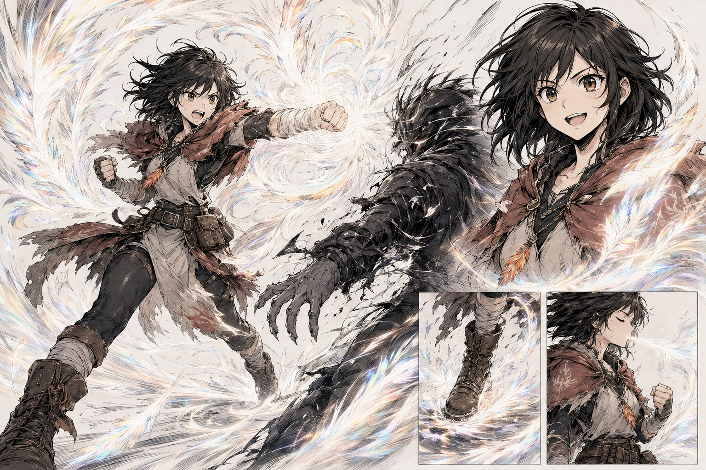

# Mira — Chamas Puras v1

> **Status:** versão histórica substituída pela v2; não usar como referência final de cor.

Primeiro estudo da forma final de Mira. Estabeleceu o núcleo branco, o movimento perfeitamente integrado ao corpo e as curvas de penas, mas o espectro cromático ficou pálido demais para a decisão canônica posterior.

## O que permanece útil

- Chama leve e fluida, que acompanha Mira sem consumi-la.
- Núcleo branco e correntes em espiral.
- Sensação de autonomia, serenidade e domínio corporal.
- Mira reconhecível em seu traje e proporções habituais.

## O que foi substituído

- Os reflexos quase brancos e pastéis deram lugar a sete cores claramente distinguíveis.
- Para qualquer arte final, usar `mira-chama-pura-v2.png` como referência canônica.

Consulte o [sistema de chamas](../../../../../../docs/sistema-de-chamas.md).
