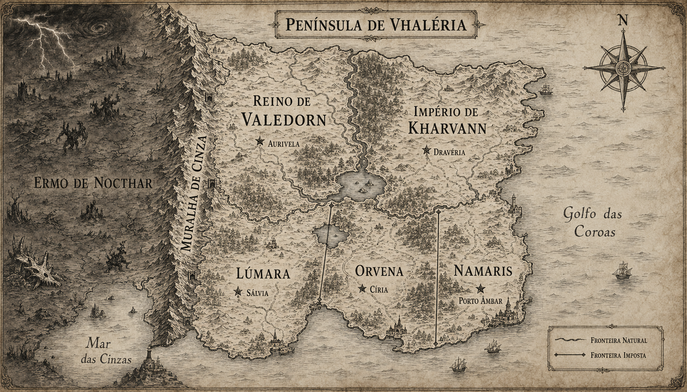

# Península de Vhaléria — mapa v1

## Estado

- **Histórico e substituído.** Não é a referência vigente.
- Preservado para registrar a primeira interpretação ilustrada do esboço.
- O nome Vhaléria foi substituído pelo nome canônico Arkenor.

## Elementos não canônicos

- O título `PENÍNSULA DE VHALÉRIA` não pertence mais ao cânone.
- Detalhes decorativos não criam cidades, povos, rotas ou eventos canônicos.

## Referências

- [Mapa e geografia](../../docs/mapa-e-geografia.md)
- [Versão vigente v2](peninsula-de-arkenor-v2.md)
