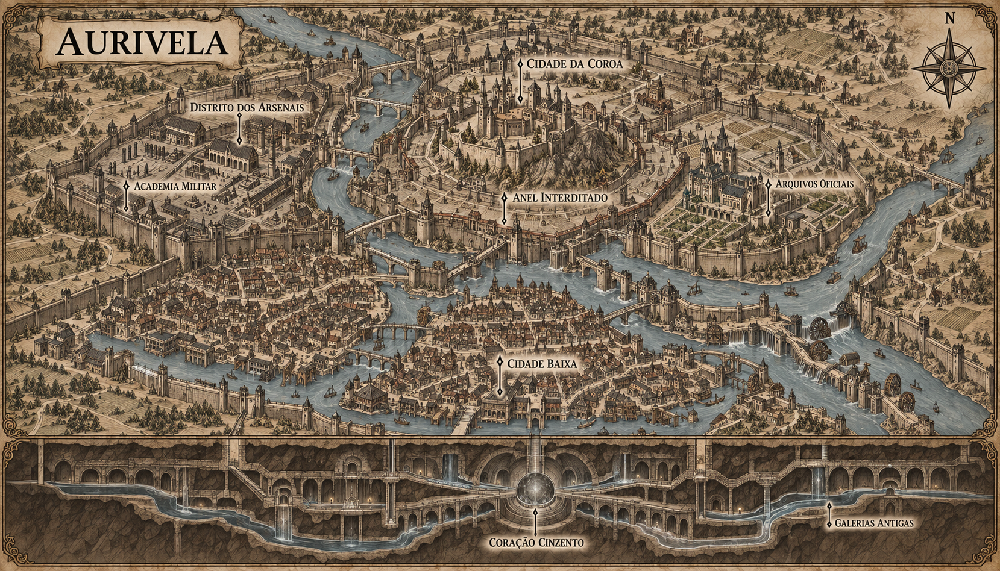

# Aurivela — mapa urbano v1

> **Status:** referência visual canônica aprovada pelo autor. Estabelece o traçado urbano geral, os setores nomeados, os círculos defensivos, a rede fluvial e a representação do subsolo.

## Intenção

Apresentar Aurivela como uma capital cuja arquitetura transforma hierarquia política em geografia. Os bairros populares ocupam as margens vulneráveis, os órgãos militares controlam um anel intermediário e a Coroa domina uma cidadela elevada. Sob todos eles, galerias anteriores ao reino convergem para o Coração Cinzento.

## Estrutura representada

- **Cidade Baixa:** mercados, moinhos, hospitais populares, cais, moradias densas e áreas sujeitas a enchentes.
- **Distrito dos Arsenais:** academia militar, pátios de treino, oficinas rúnicas, forjas, quartéis e depósitos de pedra saturada de Ânima.
- **Cidade da Coroa:** palácio fortificado, ministérios, tribunal, arquivos oficiais e jardins protegidos.
- **Anel Interditado:** faixa de ruas evacuadas e acessos lacrados sob a justificativa pública de problemas estruturais.
- **Subsolo antigo:** galerias e canais anteriores ao reino convergindo para o Coração Cinzento.

## Relações espaciais estabelecidas

- Dois rios chegam por direções diferentes, encontram-se dentro da cidade e seguem como um único curso.
- Três círculos defensivos irregulares acompanham rios e relevo.
- A Cidade Baixa ocupa margens, ilhas e áreas a jusante.
- Os Arsenais ficam em terreno controlado no anel intermediário.
- A Cidade da Coroa ocupa a elevação central entre os rios.
- O Anel Interditado acompanha parcialmente uma estrutura circular antiga.
- Escadas e acessos selados ligam os Arsenais, os arquivos e o anel às galerias subterrâneas.

## Continuidade estabelecida

- Aurivela é a capital fortificada de Valedorn e foi construída no encontro de dois rios.
- A cidade abriga a corte, arsenais rúnicos e uma academia de magia aplicada à guerra.
- O Coração Cinzento é o ponto de comando subterrâneo da Muralha de Cinza.
- Os dois rios seguem antigos canais de descarga de Ânima.
- Luz e Sombra permanecem equilibradas no Coração, permitindo que o local sustente o ritual de ascensão.

## Limites da canonização

- O traçado macro dos cinco setores, dos três círculos defensivos, dos rios, canais, muralhas e pontes é canônico.
- A aparência geral do palácio, da academia, dos arsenais, dos arquivos e dos bairros é canônica.
- A forma esférica do Coração Cinzento dentro de uma câmara circular é canônica.
- As galerias antigas convergem para o Coração e repetem a organização radial mostrada na prancha.
- A quantidade exata de casas, árvores, embarcações, torres menores e elementos decorativos pode variar conforme a cena.
- Pequenas construções e símbolos sem rótulo não criam automaticamente novos locais, instituições ou brasões canônicos.
- A localização da prisão de Ordan permanece a definir e não pode ser inferida de um edifício sem rótulo.

## Direção usada na geração

Mapa urbano horizontal em gravura medieval sépia sobre pergaminho. A superfície ocupa a maior parte da prancha e mostra a cidade de pontes organizada em três anéis defensivos. Um corte inferior revela galerias antigas alinhadas à cidade e convergindo para o Coração Cinzento. A referência visual foi o mapa regional de Valedorn v4.
