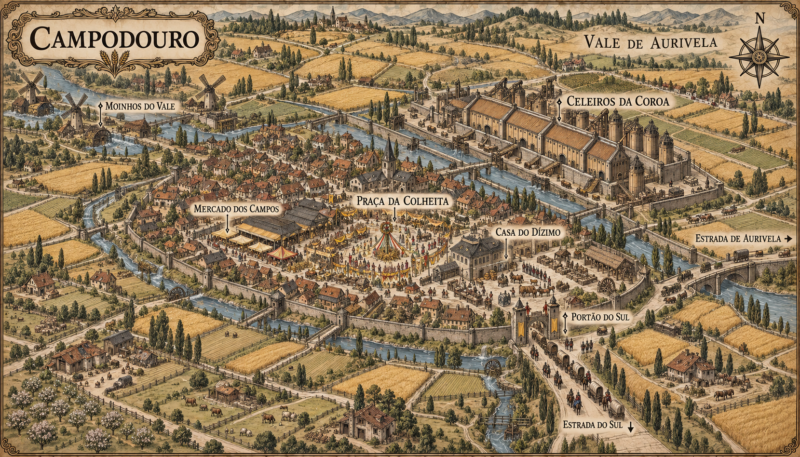

# Campodouro — mapa urbano v1

> **Status:** referência visual canônica. O conceito, a organização urbana e os locais nomeados no mapa estão estabelecidos. Pessoas, animais, veículos, bandeiras e pequenas construções sem rótulo podem variar.

## Conceito estabelecido

Campodouro é a principal cidade agrícola do Vale de Aurivela. Sua prosperidade aparece nos campos cultivados, nos celeiros imensos e nas festas da colheita, mas parte crescente dessa abundância é recolhida para sustentar a ocupação do sul.

## Estrutura canônica

- Cidade baixa e extensa, cercada por plantações, pomares, pastagens e canais de irrigação.
- Muralhas baixas e portões largos, adequados à passagem de carroças e rebanhos.
- Praça central ocupada pelo festival da colheita.
- Grande complexo de celeiros ligado à administração da Coroa.
- Casa de arrecadação junto à saída dos comboios tributários.
- Mercado agrícola, moinhos e estradas para Aurivela e para o sul.

## Contraste narrativo

O centro da cidade celebra a fartura produzida pelo vale, enquanto guardas supervisionam carroças carregadas para fora de Campodouro. A mesma colheita que sustenta a comunidade também alimenta uma campanha distante.

## Locais estabelecidos

- **Praça da Colheita**, centro dos festivais e da vida pública.
- **Celeiros da Coroa**, grande complexo fortificado de armazenamento.
- **Casa do Dízimo**, sede da arrecadação ligada aos comboios tributários.
- **Mercado dos Campos**, núcleo de comércio da produção rural.
- **Moinhos do Vale**, conjunto movido pelos canais a oeste.
- **Portão do Sul**, saída fortificada utilizada pelos comboios.
- **Estrada de Aurivela** e **Estrada do Sul**, principais ligações terrestres da cidade.

## Limites do cânone

O mapa estabelece a disposição geral da cidade, dos canais, dos campos, das muralhas e dos locais nomeados. Cultivos específicos, bandeiras, figuras humanas, animais, veículos e pequenas construções sem rótulo podem variar sem quebrar a continuidade.

O tom dourado dos campos funciona como recurso de leitura do mapa e não fixa uma única estação ou cor permanente para o vale.

## Direção visual

Gravura cartográfica medieval em tinta sépia sobre pergaminho, vista aérea oblíqua, coerente com os mapas de Valedorn e Aurivela. A composição usa a abundância visual dos campos e da festa para contrastar com a escala institucional dos celeiros e com o comboio tributário que segue para o sul.

## Referências de continuidade

- `../regional/valedorn-regional-v4.png`: posição regional de Campodouro no Vale de Aurivela.
- `../aurivela/aurivela-mapa-urbano-v1.png`: linguagem cartográfica e relação viária com a capital.
