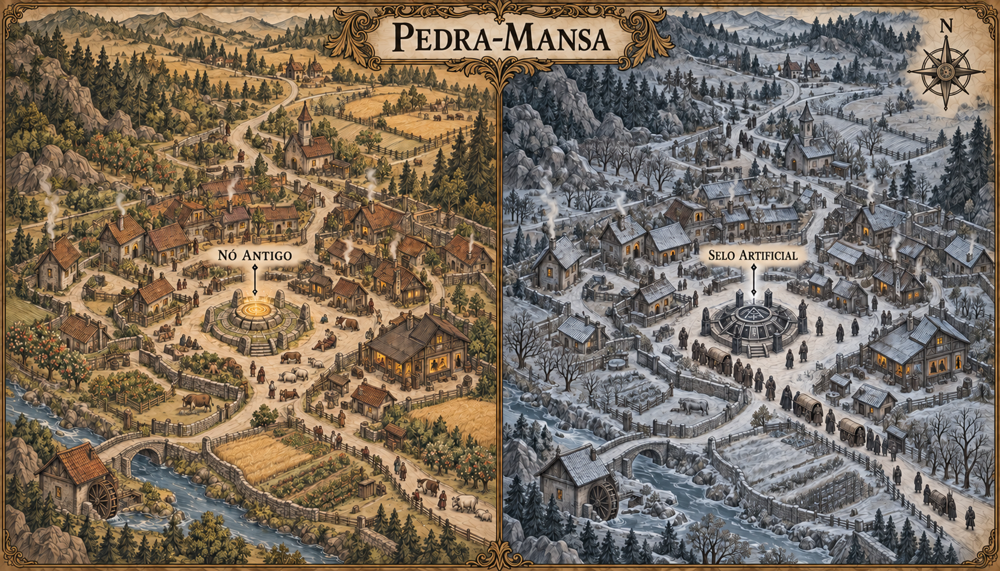

# Pedra-Mansa — mapa urbano v1

> **Status:** referência visual canônica aprovada pelo autor. Estabelece a composição em dois tempos, o traçado geral do povoado, a aparência do Nó Antigo e do Selo Artificial e os efeitos visíveis da substituição.

## Conceito estabelecido

Pedra-Mansa é um povoado construído ao redor de um nó antigo da Muralha. Pessoas e animais dormem melhor perto dele sem conhecer a causa desse repouso incomum.

Quando o nó é substituído por um selo artificial, Pedra-Mansa muda. Começam os pesadelos, o frio persistente e mortes inexplicáveis.

## Estrutura canônica

O mapa apresenta o mesmo povoado em dois momentos, preservando estradas, casas, campos, curso d'água e edifícios para tornar a substituição do nó a causa visual da transformação.

- **Nó antigo:** círculo baixo de pedras antigas, parcialmente enterrado e integrado à praça central.
- **Antes da substituição:** campos férteis, pomares, água corrente, lareiras acesas e habitantes e animais repousando próximos ao nó.
- **Selo artificial:** estrutura geométrica mais recente, feita de pedra clara e metal escuro, instalada no mesmo encaixe central.
- **Depois da substituição:** geada sobre ruas e telhados, vegetação adoecida, água congelando, vigília noturna e cortejos ligados às mortes inexplicáveis.

## Leitura narrativa

O antigo nó não é cultuado como templo. Ele faz parte da vida cotidiana e seu efeito é confundido com a tranquilidade natural do lugar. O selo artificial preserva a aparência de infraestrutura defensiva, mas rompe o equilíbrio que tornava Pedra-Mansa segura.

## Limites da canonização

- A disposição geral das ruas, dos campos, do curso d'água e dos edifícios é canônica.
- O Nó Antigo é uma estrutura circular baixa, parcialmente enterrada e integrada à praça central.
- O Selo Artificial é uma construção geométrica mais recente, de pedra clara e metal escuro, instalada no mesmo encaixe.
- A geada, a vegetação adoecida, o congelamento da água e os cortejos tornam visíveis as consequências da substituição.
- A quantidade e a aparência exatas de pessoas, animais, carroças e pequenas construções sem identificação podem variar.

O contraste entre dourado e azul acinzentado separa os dois momentos. A mudança não é uma simples passagem de estação: o frio persistente é consequência da substituição do nó.

## Direção usada na geração

Mapa narrativo horizontal em gravura medieval sépia sobre pergaminho, dividido em dois estados cronológicos do mesmo povoado. O lado do nó antigo usa calor discreto e repouso; o lado do selo artificial repete a geografia sob frio, insônia e morte silenciosa. O mapa regional de Valedorn v4 e o mapa urbano de Campodouro v1 serviram como referências visuais.

## Referências de continuidade

- `../regional/valedorn-regional-v4.png`: posição regional de Pedra-Mansa.
- `../campodouro/campodouro-mapa-urbano-v1.png`: linguagem cartográfica urbana de Valedorn.
