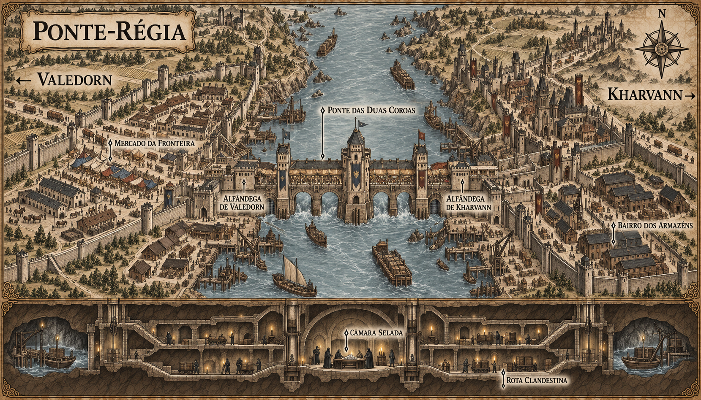

# Ponte-Régia — mapa urbano v1

> **Status:** referência visual canônica aprovada pelo autor. Estabelece a organização das duas margens, a ponte-cidadela, as alfândegas e o sistema clandestino inferior.

## Conceito estabelecido

Ponte-Régia é uma cidade fortificada construída sobre o grande rio que separa Valedorn de Kharvann. Oficialmente funciona como centro comercial e alfandegário. Secretamente, representantes das duas potências rivais negociam pedra saturada de Ânima e tecnologia de selos artificiais.

## Estrutura representada

- Valedorn ocupa a margem oeste e Kharvann a margem leste.
- Uma ponte-cidadela larga concentra lojas, inspeções, circulação de caravanas e uma torre central.
- Alfândegas e fortificações independentes guardam cada cabeceira.
- Mercado, hospedarias, estábulos e pátios de caravanas ocupam a margem de Valedorn.
- Escritórios mercantis e armazéns murados ocupam a margem de Kharvann.
- Cais, barcaças e guindastes medievais permitem transporte fluvial nas duas margens.
- Sob a ponte, porões, pilares ocos, galerias e cais ocultos conectam as duas administrações.

## Duplicidade narrativa

Na superfície, bandeiras separadas, portões e inspeções encenam desconfiança política. No subsolo, guardas e agentes dos dois governos utilizam a mesma rota, os mesmos elevadores de carga e uma única mesa de negociação. O comércio público justifica o movimento constante de mercadorias necessário para esconder o tráfico de minério e componentes rúnicos.

## Elementos estabelecidos pela canonização

- **Ponte das Duas Coroas:** nome da ponte-cidadela central.
- **Mercado da Fronteira:** nome do mercado público na margem de Valedorn.
- **Bairro dos Armazéns:** nome do setor mercantil na margem de Kharvann.
- **Câmara Selada:** sala subterrânea usada nas negociações secretas.
- **Rota Clandestina:** conjunto de túneis, cais ocultos e porões conectados.
- A arquitetura geral, a escala relativa, as principais torres, a posição dos cais e o desenho macro das muralhas.

## Limites da canonização

- Símbolos e bandeiras desenhados na imagem não estabelecem brasões nacionais canônicos.
- A quantidade exata de casas, barcos, carroças, lojas, guardas e armazéns pode variar.
- O brilho discreto nas caixas representa pedra saturada de Ânima e não estabelece cor ou aparência definitiva do minério.
- Pessoas sem nome são figuras de escala e não criam personagens canônicos.

## Direção usada na geração

Mapa urbano horizontal em gravura medieval sépia sobre pergaminho. Um rio vertical divide as duas potências; a ponte-cidadela e as alfândegas dominam a superfície. Um corte inferior revela a câmara e a rota clandestina sob os pilares. Os mapas de Valedorn v4 e Aurivela v1 serviram como referências de geografia e acabamento.
