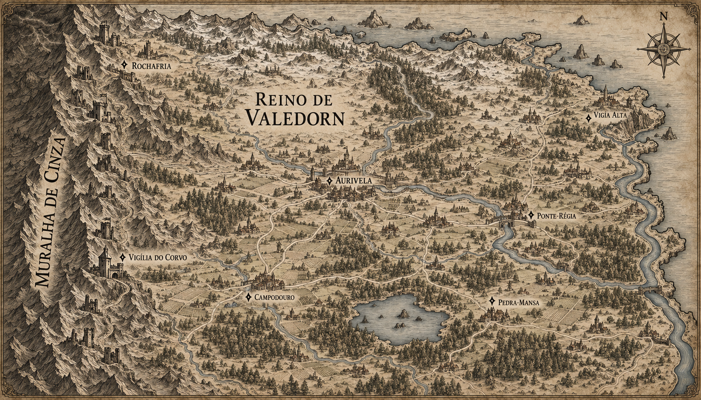

# Reino de Valedorn — mapa regional v1

> **Status:** versão histórica, substituída pela v2. Nesta versão, a área à direita do rio oriental parecia oceano em vez do território de Kharvann.

## Intenção

Ampliar Valedorn a partir do mapa canônico da Península de Arkenor e tornar visível a desigualdade entre a fronteira ocidental e o interior do reino.

- A Muralha de Cinza ocupa toda a borda oeste.
- Uma antiga cadeia de fortalezas acompanha a cordilheira; várias aparecem arruinadas ou desativadas.
- Rochafria e a Vigília do Corvo ficam próximas da região negligenciada.
- Estradas, cidades e sedes de guilda tornam-se mais densas em direção a Aurivela e aos vales férteis.
- Aurivela permanece no encontro de dois rios.

## Elementos estabelecidos representados

- Fortalezas foram erguidas para enfrentar uma ameaça que, por gerações, pareceu nunca chegar.
- Com o tempo, parte dessas fortalezas foi desativada.
- As guildas próximas da Muralha perderam contratos, recursos, prestígio e atenção política.
- Guildas do interior passaram a concentrar investimentos e melhores conexões viárias.

## Elementos ainda propostos

- A quantidade exata de fortalezas e a proporção entre postos desativados e ativos.
- As posições exatas de Rochafria, da Vigília do Corvo e dos assentamentos no mapa regional.
- Os nomes Ponte-Régia, Campodouro, Vigia Alta e Pedra-Mansa.
- A distribuição específica de estradas, bosques, aldeias e áreas agrícolas.

## Direção visual usada

Mapa medieval horizontal em tinta sépia sobre pergaminho envelhecido, com topografia em gravura. A referência de composição e continuidade geográfica foi o mapa canônico `peninsula-de-arkenor-v2.png`. O mapa amplia Valedorn entre a Muralha de Cinza, o rio oriental, as fronteiras meridionais e o litoral norte. A cadeia defensiva ocidental aparece degradada, enquanto o interior possui maior densidade urbana e viária.

## Restrições de continuidade

- Este mapa não substitui o mapa canônico da Península de Arkenor.
- Os nomes novos não são canônicos até aprovação.
- O desenho não estabelece que todas as fortalezas tenham sido abandonadas ao mesmo tempo ou pela mesma autoridade.
- Pequenas construções sem rótulo são composição cartográfica e não criam automaticamente cidades canônicas.

## Divergências observadas na v1

- A arte desenhou mais torres do que a referência inicial de sete fortalezas; elas devem ser lidas como evocação de uma cadeia defensiva, não como contagem canônica.
- Ruínas e torres preservadas são visualmente diferentes, mas o mapa ainda não identifica de maneira inequívoca quais postos continuam ativos.
