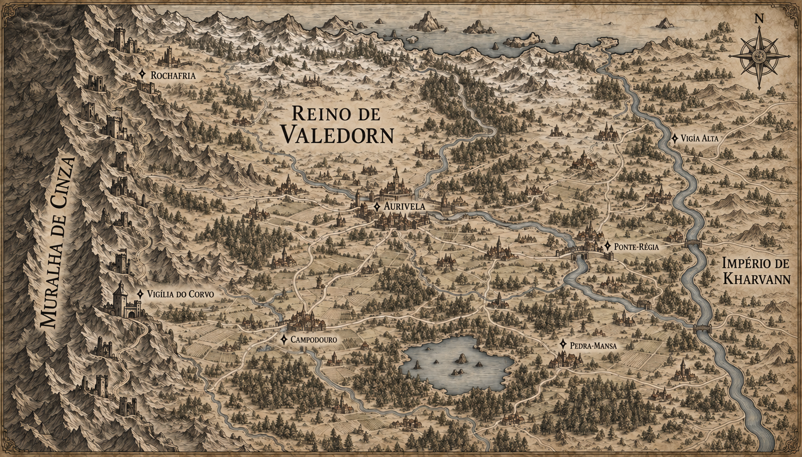

# Reino de Valedorn — mapa regional v2

> **Status:** versão histórica, substituída pela v3. Corrigiu a presença de Kharvann a leste, mas ainda deixou o Lago Partido dentro de Valedorn e não mostrou adequadamente as fronteiras com Lúmara e Orvena.

## Alteração em relação à v1

- O grande curso d'água oriental passa a ser legível como rio de fronteira.
- A margem direita mostra terra contínua pertencente ao Império de Kharvann, em vez de parecer um oceano.
- O território de Kharvann possui apenas relevo, bosques e estradas discretos, preservando Valedorn como foco do mapa.
- Pontes existentes agora ligam visualmente os dois territórios.

## Elementos preservados

- Muralha de Cinza e cadeia de fortalezas no oeste.
- Rochafria e Vigília do Corvo próximas da montanha.
- Aurivela no encontro dos rios.
- Campodouro, Ponte-Régia, Pedra-Mansa e Vigia Alta nas posições propostas.
- Concentração de estradas e assentamentos no interior de Valedorn.
- Estilo de gravura medieval em tinta sépia sobre pergaminho.

## Estado de continuidade

- A existência de Kharvann na margem oriental do rio é estabelecida pelo mapa canônico da Península de Arkenor.
- A aparência específica dessa faixa de Kharvann é apenas composição cartográfica.
- Os nomes Campodouro, Ponte-Régia, Pedra-Mansa e Vigia Alta continuam propostos.
- Construções sem rótulo não criam cidades canônicas.

## Direção usada na edição

Editar somente a faixa oriental do mapa v1, substituindo a aparência de costa ou oceano por território terrestre simples de Kharvann. Manter o rio como fronteira, adicionar o rótulo `IMPÉRIO DE KHARVANN` e preservar o restante do mapa, seus nomes, estradas, fortalezas, moldura, rosa dos ventos e estilo visual.
