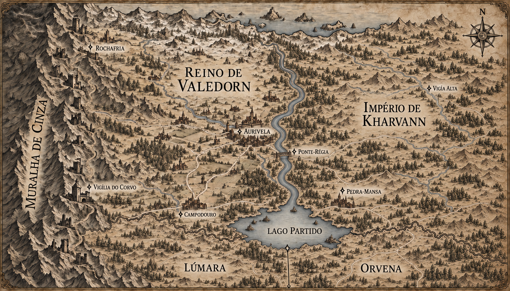

# Reino de Valedorn — mapa regional v3

> **Status:** versão histórica. O ajuste final que simplificava o rio foi preterido pelo autor em favor da composição anterior, preservada como v4.

## Alterações em relação à v2

- Um único grande rio estabelece a fronteira oriental entre Valedorn e Kharvann.
- Esse rio corre do norte e desemboca diretamente na margem norte do Lago Partido.
- O Lago Partido ocupa a fronteira meridional, em vez de ficar inteiramente dentro de Valedorn.
- Lúmara aparece ao sul e sudoeste do lago, fazendo fronteira com Valedorn.
- Orvena aparece ao sul e sudeste do lago, também fazendo fronteira com Valedorn.
- A fronteira reta imposta entre Lúmara e Orvena parte da margem sul do Lago Partido.
- Ponte-Régia foi reposicionada sobre o rio fronteiriço.

## Continuidade preservada

- Muralha de Cinza e cadeia de fortalezas no oeste.
- Rochafria e Vigília do Corvo próximas da montanha.
- Aurivela em Valedorn, a oeste do rio de fronteira.
- Kharvann ocupa terra firme a leste do rio.
- O desenho dos países vizinhos permanece simples para manter Valedorn como foco.
- Estilo de gravura medieval em tinta sépia sobre pergaminho.

## Estado dos elementos

- A relação geográfica entre os quatro países, o rio e o Lago Partido segue o mapa canônico da Península de Arkenor.
- Campodouro, Ponte-Régia, Pedra-Mansa e Vigia Alta continuam nomes propostos.
- A posição exata dessas cidades e das estradas continua proposta.
- Construções sem rótulo são composição cartográfica e não criam assentamentos canônicos.

## Direção usada na edição

Usar o mapa canônico da Península de Arkenor como autoridade. Colocar Valedorn a noroeste do Lago Partido, Kharvann a nordeste, Lúmara ao sul e sudoeste e Orvena ao sul e sudeste. Fazer o rio Valedorn–Kharvann desembocar no lago e mostrar a fronteira reta Lúmara–Orvena partindo de sua margem sul, preservando a Muralha, as fortalezas e os principais locais de Valedorn.
