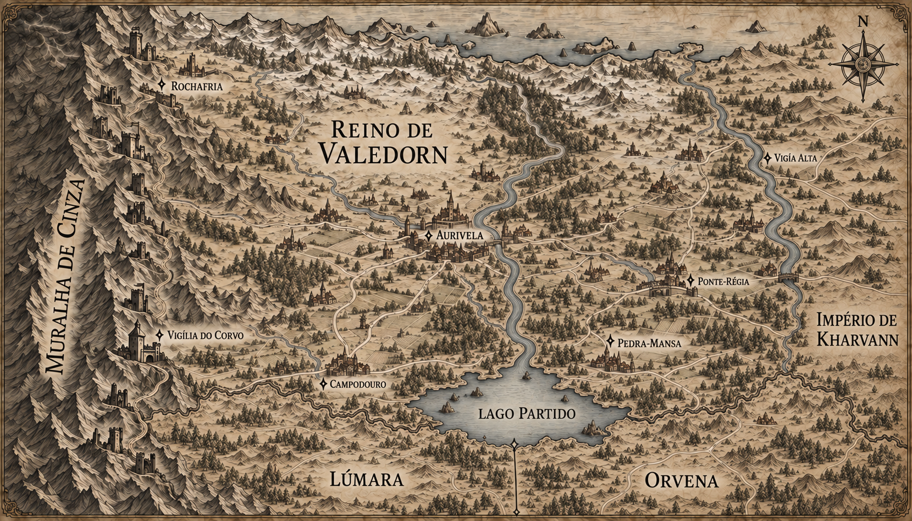

# Reino de Valedorn — mapa regional v4

> **Status:** proposta visual vigente, escolhida pelo autor em preferência à v3. Ponte-Régia, Campodouro e Pedra-Mansa estão estabelecidas; os demais nomes novos ainda aguardam aprovação canônica.

## Origem da versão

Esta versão preserva a primeira composição produzida para incluir o Lago Partido e os dois países meridionais. Ela foi escolhida pelo autor em preferência à tentativa posterior de simplificar o rio fronteiriço.

## Geografia representada

- O Lago Partido aparece sobre a fronteira meridional de Valedorn.
- Um grande rio vindo do norte desemboca no lago.
- Kharvann ocupa terra firme a leste.
- Lúmara aparece ao sul e sudoeste do lago.
- Orvena aparece ao sul e sudeste do lago.
- A fronteira reta imposta entre Lúmara e Orvena parte da margem sul do lago.
- Valedorn mantém fronteiras visíveis com os três países vizinhos.

## Continuidade preservada

- Muralha de Cinza e cadeia de fortalezas no oeste.
- Rochafria e Vigília do Corvo próximas da montanha.
- Aurivela no interior de Valedorn.
- Concentração de estradas e assentamentos no interior do reino.
- Estilo de gravura medieval em tinta sépia sobre pergaminho.

## Elementos ainda propostos

- Vigia Alta.
- Posição exata das cidades, estradas, rios secundários e fortalezas.
- Forma detalhada das margens e fronteiras no mapa regional.
- Construções sem rótulo permanecem composição cartográfica.

## Ponte-Régia — estabelecida

O nome, a posição sobre o rio de fronteira, a função comercial pública e a negociação secreta entre Valedorn e Kharvann são canônicos. Sua posição exata nesta escala pode ser refinada sem alterar a relação geográfica.

## Campodouro — estabelecida

O nome, a posição no Vale de Aurivela e a função de principal cidade agrícola da região estão estabelecidos. Campodouro possui celeiros imensos e festivais da colheita, em contraste com os impostos cobrados para sustentar a ocupação do sul. O mapa urbano v1 de Campodouro é canônico; sua posição exata nesta escala regional pode ser refinada sem alterar essa relação geográfica.

## Pedra-Mansa — estabelecida

O nome e a natureza de Pedra-Mansa como povoado construído ao redor de um nó antigo da Muralha estão estabelecidos. A proximidade do nó melhora o sono de pessoas e animais; sua substituição por um selo artificial provoca pesadelos, frio persistente e mortes inexplicáveis. O mapa urbano v1 é canônico, e a posição exata do povoado nesta escala regional pode ser refinada.
