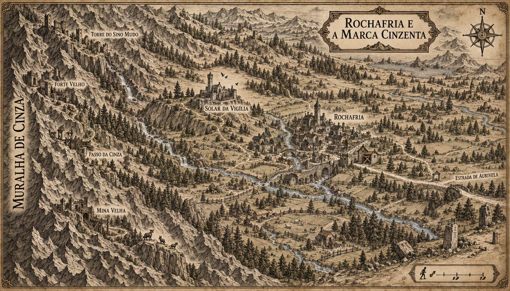

# Rochafria e a Marca Cinzenta — mapa v1

> **Status:** proposta visual. A posição geral de Rochafria, do Solar da Vigília e da Muralha segue o cânone; nomes e localizações adicionais aguardam aprovação.

## Função do mapa

Detalhar a região de origem de Mira e mostrar como a negligência política de Valedorn aparece na paisagem: defesas antigas abandonadas, trilhas militares deterioradas e estruturas de guilda modestas junto à montanha.

## Continuidade preservada

- A Muralha de Cinza domina o horizonte ocidental.
- Rochafria é uma cidade pequena no pé da cordilheira.
- O Solar da Vigília ocupa uma elevação separada da cidade e fica a cerca de quinze minutos de caminhada.
- O Solar é um pequeno castelo gótico reaproveitado, habitável, remendado e com torre de observação voltada para as montanhas.
- Riachos descem da Muralha e ajudam a explicar os canais de Rochafria.
- A economia local inclui criação de cabras e ovelhas, ervas de altitude e mineração em pequena escala.
- A estrada oriental conecta a região ao interior de Valedorn.

## Propostas visuais

- **Marca Cinzenta:** nome regional para a faixa de povoados, trilhas e antigas defesas junto à Muralha.
- **Forte Velho:** fortaleza desativada numa trilha elevada.
- **Torre do Sino Mudo:** ruína defensiva mais ao norte, concebida como antigo ponto de alarme.
- **Passo da Cinza:** passagem montanhosa com posto de vigia reduzido.
- **Mina Velha:** exploração local abandonada ou pouco produtiva.
- A localização exata das fortalezas, riachos, pontes, pastos, bosques e estradas secundárias.

## Leitura narrativa

A estrada para Aurivela é larga e mantida, enquanto as rotas que sobem para as fortalezas estão desaparecendo. As ruínas não parecem derrotadas numa guerra recente: foram esvaziadas lentamente porque o reino deixou de acreditar na ameaça. O Solar permanece funcional graças a reparos locais, não por investimento da Coroa.

## Divergências e limites

- Construções pequenas sem nome são composição cartográfica e não criam novos povoados canônicos.
- A escala gráfica é decorativa e não estabelece distâncias numéricas.
- A arte sugere mais estruturas defensivas do que as duas ruínas nomeadas; a quantidade total continua a definir.
- A aparência individual das fortalezas não é canônica até aprovação.

## Direção usada na geração

Mapa medieval horizontal em tinta sépia sobre pergaminho. A Muralha ocupa o oeste; Rochafria aparece no vale; o Solar fica numa elevação entre cidade e montanha; três fortalezas desativadas e um posto reduzido ocupam as trilhas altas; riachos, pastos, pinheiros, mina antiga e a estrada para Aurivela completam a região. Foram usadas como referência visual o mapa regional de Valedorn, a praça de Rochafria e a prancha arquitetônica do Solar da Vigília.

